{width="5.869792213473316in"
height="1.4674475065616799in"}

## **Group Members:**

-   Yann Ndjatang: 18337813

-   Fawwaz Kekere-Ekun: 18408814

## **[Table of contents]{.ul}**

1.  **[Introduction]{.ul}**

    1.  Overview

    2.  Glossary

2.  **[System Architecture]{.ul}**

    1.  Description of System Architecture

    2.  Diagram of System Architecture

    3.  Data Flow Diagram

3.  **[High-Level Design]{.ul}**

    1.  Context Diagram

    2.  State-Machine Diagrams

    3.  Class Diagram

    4.  Component Diagram

    5.  Database Data Organisation

4.  **[Problems and Resolution]{.ul}**

    1.  Multiple User implementation

    2.  Quiz

    3.  Enrolling in a course

5.  **[Installation Guide]{.ul}**

    1.  Prerequisites

    2.  Setting up the project

    3.  Run server from terminal

## 

## **Introduction**

**1.1 Overview**

TutorO is a free to use web app aimed at both Students of 3rd level
education and tutors with the qualifications to teach those students.

The aim of our app was to connect students and tutors on an online
platform which would allow students to get a personalised learning
experience and also allow them to learn from the comfort of their own
homes. This has been seen to be even more important due to the current
ongoing issues in our world at the moment.

A lot of the development of this project went into actually making sure
that the backend was actually working correctly rather than the
frontend. This was because in order for the frontend to even be viewed
correctly we had to make sure that all the necessary databases were
linking together correctly and that all the data that we were trying to
retrieve was being queried from the right places. So as much as this was
a project to create a webapp it was just as much a project on the
creation of a well structured responsive database.

The main features of the app **[for tutors are]{.ul}**:

-   Creating a course for students to join

-   Having the ability to create personalised quizzes

-   Allowing multiple answers to be considered correct

-   Viewing results of quizzes that have been created

-   Changing questions in already set up quiz with ease

-   Deleting any quizzes or associated questions with ease.

**[for students are]{.ul}**:

-   Having the ability to have interests in multiple subjects.

-   Being able to enroll in a course easily.

-   Being able to take quizzes that have been assigned by a tutor

TutorO was developed using the python django framework in which html,
python and css were utilised. We came across django as recommended to us
by our project supervisor and decided to stick with it because django
offered an in-built database framework(SQLite) and combined python which
we were familiar with. This was also handy for us because it meant that
we were able to use python to query the database and to also create our
own custom models and relationships without actually having to ever
write a line of SQL. Django also had in-built user authentications
features which would save us time in not having to create our own custom
user authentications.

For the user interface we went a with a minimal but appealing design. We
designed some mock interface with which we consulted our family and
friends for feedback on the design. We used our own CSS in combination
with Bootstrap 4 for the forms. This helped us save time and allowed us
to create a consistent look and feel to our web application. From the
home page, login page to the student and tutor pages, our user interface
uses bright, warm and inviting colors making the user feel at home.

With the advice that we were able to get from user testers we were able
to style the page in a way that it wouldn't be a nuisance to navigate
for anybody.

Here are some examples of the styling before to the styling afterwards:

**Before:**

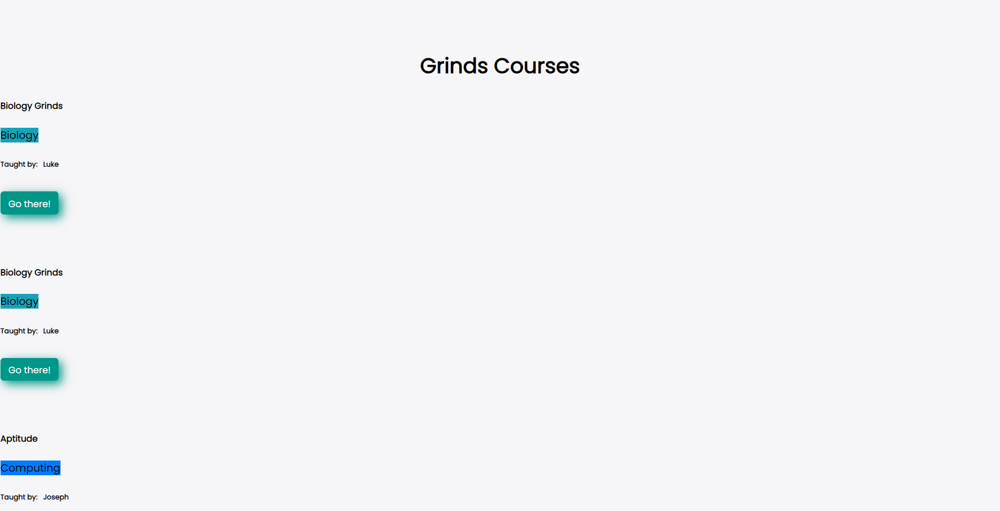{width="5.260416666666667in"
height="3.197082239720035in"}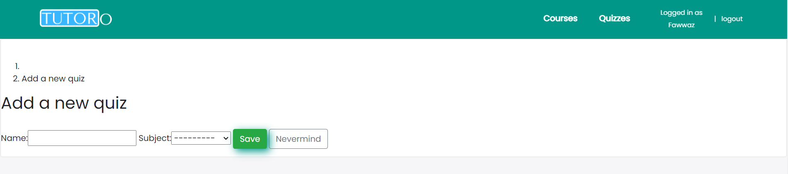{width="6.5in"
height="1.4444444444444444in"}

**After:**

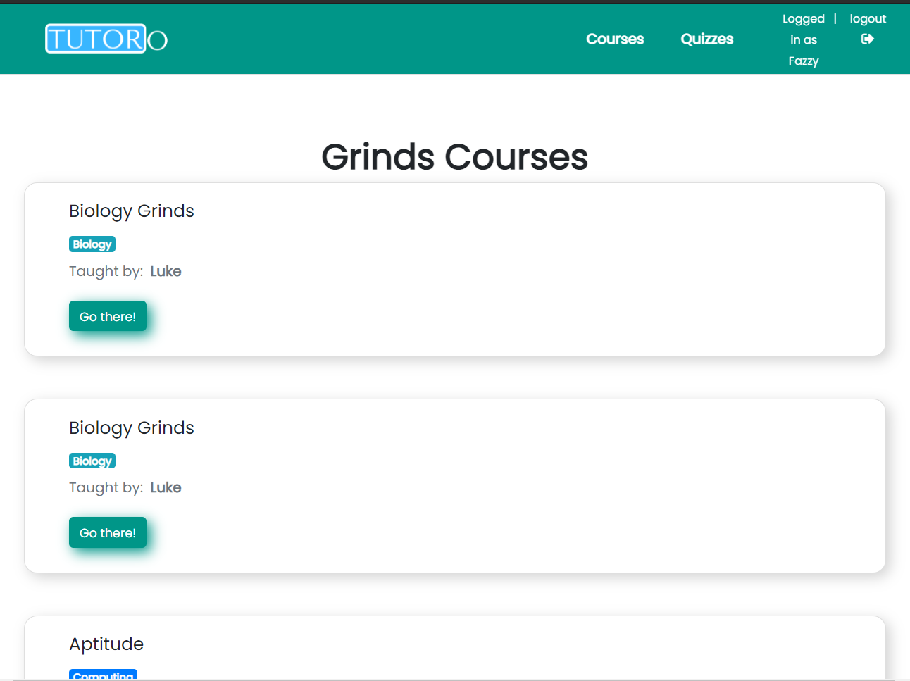{width="4.46875in"
height="3.1041666666666665in"}

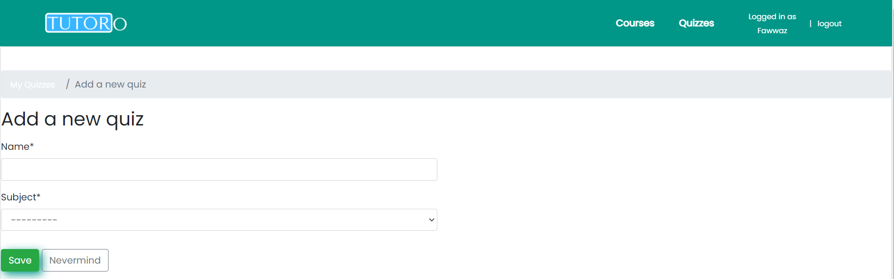{width="6.5in" height="2.0416666666666665in"}

**1.2 Glossary**

-   **Django Framework:** Django is a high level Python web framework
    > that allows for the development of secure and maintainable
    > websites.

-   **Django User Authentication:** The Django authentication system
    > handles both authorization of users as well as authentication of
    > users. It checks what permissions that users have and makes sure
    > that their usernames are unique when creating users.

-   **Web Domain:** A web domain essentially a url and is linked to an
    > ip address in which a website is located on the internet.

-   **Database Models:** A database model refers to the structure in
    > which data is held within an established database. It can also be
    > used to refer to a single table of data in which a user\'s data or
    > a Subject\'s data is stored for example.

-   **SQlite Database:** SQLite is a subsidiary of the SQL database
    > engine. It is based in C language which implements all the
    > features of the SQL engine in a small, fast and self contained
    > setting.

-   **Many to many, One to many, etc..:** These terms refer to the
    > relationship between a database model. A many to one relationship
    > insinuates that a particular model type can have many links to
    > another model type but the latter can only link to one model type.

## **System Architecture**

**2.1 System Architecture Description**

**[Overview]{.ul}**

The current System Architecture has changed from our initial proposed
system architecture in our functional specification. The system
architecture of our web app follows a two tier structure with the major
component being the python django framework. Although the django
framework is technically the only major component it holds all other
components within it. The django framework does the job of holding both
our frontend and back end technology all in the same place. Our back end
being the framework itself in combination with the SQlite database and
the frontend being the html and css used to write the code for our
webapp.

The data that was used in the development of our project was stored in
the SQlite database which was run in realtime. This was then retrieved
using queries that were made possible with the additional libraries that
were built into the python Django framework. Because the database was
built into the django framework there was no need to use the likes of
websockets or any POST or GET tags to retrieve the data as it was not
stored in a separate remote location. This made it easy for the data to
be retrieved as all was needed was simple python code.

**[Database Authentication]{.ul}**

Through django\'s built user authentication library we were also able to
verify whether a user registering for or signing into the website was a
student or a tutor. This was done by adding our own custom flags,
"is_tutor" & "is_student" to the stock django user model and setting the
boolean value as either True or false depending on what view the user
was registering for. When signing in then, the flag would be checked to
see whether the user was a student or a tutor and would redirect them to
the correct dashboard page depending on which was True. With an
authentication library available we were also able to create method
decorators for our web pages easily. Our method decorators were used to
modify the behaviour of our views to only allow certain pages to be
viewed by certain users if they had already been authenticated as a
particular type of student otherwise be denied access to such pages.

**[Database relationships and App Creation]{.ul}**

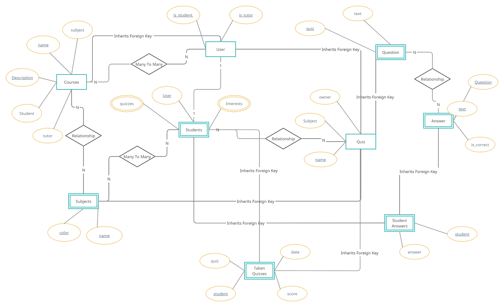{width="8.362931977252844in"
height="5.6932272528433945in"}

In creating the database models we had to overhaul our initial basic
design idea and create a more complex structure for our data to be
stored. We created many tables in which our data for different things
would be stored. This made the backend quite complex. We initially had
just the users database which would store the users data but then we
needed the students to be able to pick their interests in subjects, to
be able to enroll in subjects and to also be able to take quizzes. There
was also a similar situation with tutors in which they needed to be able
to create quizzes, create questions for said quizzes and create courses.
This called for many different models to be created and all linked
properly so that data was able to be retrieved without constantly
backtracking or having to jump tables.This is what led to the creation
of multiple django apps which would hold different information on
different models and would link different information on web pages
together.

The quiz app contains the adjusted User model which holds both the
"is_tutor" & "is_student" flags with the boolean values set to false by
default. These values would change depending on what user registration
form is filled out. Eg. when a user registers as a tutor the user is
saved and the "is_tutor" flag is set to true letting the database know
that this user is a tutor. This is accomplished with the tutor_register
view contained in views.py in the users app which uses the
TutorSignUpform in the forms.py file to set the flag. This process is
the same for when a user signs up as a student.

The subject model holds the different subjects tutors are able to
provide grinds on and subjects that students might be interested in.
Since quizzes can only be created by tutors, the quiz model has an owner
field which takes in the User model as a foreign key. This is used later
to distinguish which quizzes are displayed depending on the course a
student has joined.

The question model holds the quiz model as a foreign key and the
question itself is returned as a characters field. The answer model uses
the question model as a foreign key, the answer itself as a character
field and a is_correct boolean value which is set to false by default.
The flag is turned to True when a student's answer is correct.

The student model holds the User model as a one-to-one relationship as
every student user is unique. It also holds quizzes as a many-to-many
relationship allowing students to view and take multiple quizzes. The
student model has a get_unswered function to get the questions not
answered yet by filtering out the answered questions.

The TakenQuiz model holds the quizzes already taken by the students.
This is queried later on in the taken quiz ListView to display the
quizzes already completed by the student. This model holds the Student
and Quiz models as foreign keys.

The StudentAnswer model simply holds the student and answer models as
foreign keys.

The dashboard app only holds one model; Course model. This holds the
course name along with the description of the course. Students can
enroll in many courses and courses can hold many students due to its
many-to-many relationship. The course model has a tutor field which is
the current user creating a course, as a foreign key.

**[Frontend]{.ul}**

Our frontend was created with HTML and CSS. The CSS was stored in the
static folder and our HTML files were stored in each app's template
folder. Each template folder contained a base template which was a HTML
file that every other HTML file would contain such as the navbar,
bootstrap and our CSS. Every other HTML file inherited from this base
template file. This prevented us from writing repeating code. These
template files were then rendered with their corresponding view files.
Each view function allowed us to directly query the database by allowing
us to specify which model our template will be querying. Method
decorators was created in the decorators.py, which was used on each view
class and function to set different permissions for the two users. This
meant a student user would not be able to access a tutor view and vice
versa.

**[Overall]{.ul}**

Thanks to the django framework a complex task was made easier for us as
we were able to link a lot of different database models together without
having to write complex code.

This was because django had a number of built in methods in its library
that allowed us to query database models as well as load them up with
ease if they had been correctly linked together by us.

**2.2 System Architecture Diagram**

**[Two Tier Architecture]{.ul}**

## 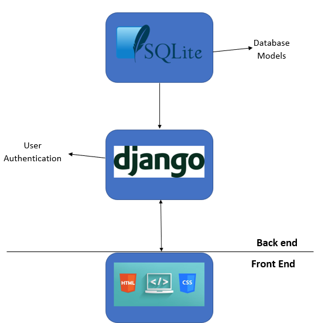{width="4.854166666666667in" height="3.494792213473316in"}

**2.3 Class Diagram**

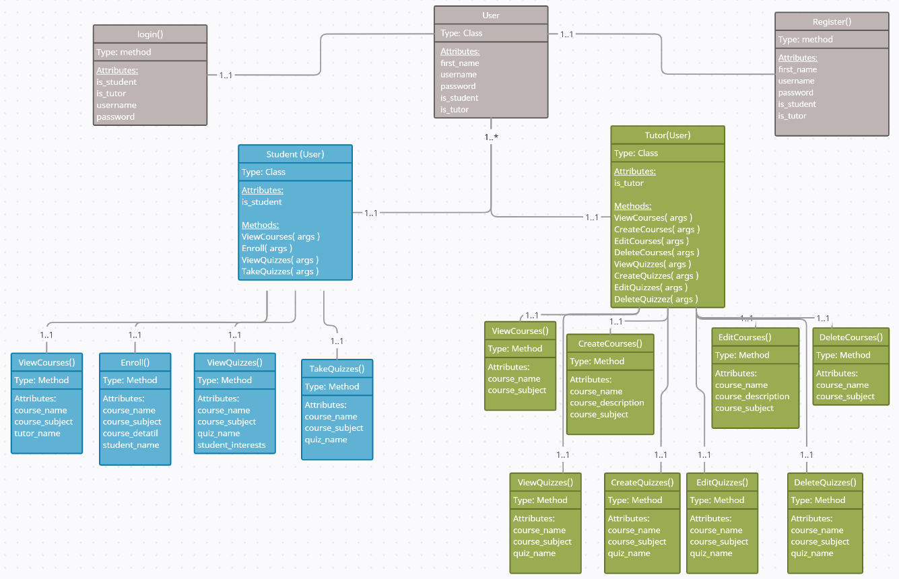{width="7.958333333333333in"
height="7.53586832895888in"}

## 

## **High-Level Design**

**3.1 Context Diagram**

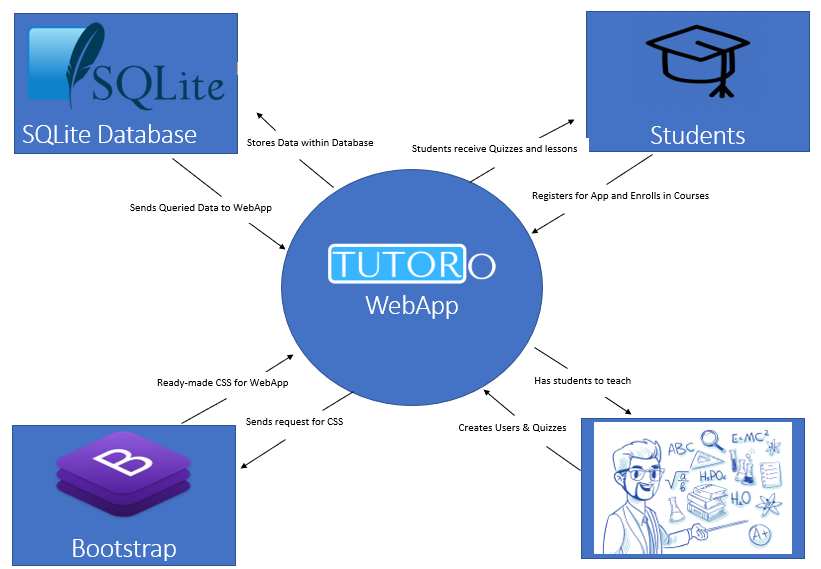{width="6.5in" height="4.5in"}

This Diagram shows the relationship between the WebApp and the software
used to create and hold its data. It also shows the relationship between
the WebApp and its users. We see that the WebApp requests CSS data from
Bootstrap using its CDN and that Bootstrap sends the ready-made CSS back
to the WebApp to be used. The WebApp also creates and stores its data
within the SQLite database and then it sends queries to it and the
queried data is sent by SQLite to be loaded up by the WebApp when
needed.

If we look at the relationship between tutors and the WebApp we see that
the tutor creates Courses and quizzes for the Students when they access
the WebApp and that they receive students to teach. On the flip side
Students register and Enroll for courses and the app gives them quizzes
and lessons that have been created by the tutors.

**3.2 State-Machine Diagrams**

**[State Diagrams (Student)]{.ul}**

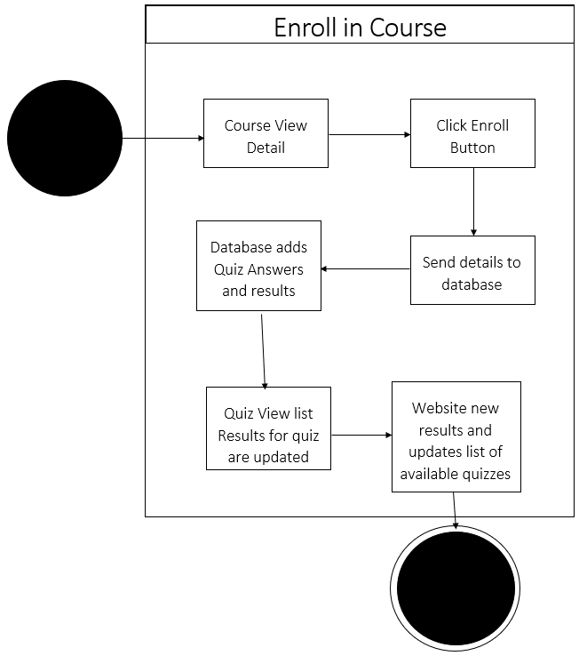{width="3.4063385826771655in"
height="5.41364501312336in"}
{width="3.658416447944007in"
height="5.416091426071741in"}

-   The Enroll in Course state diagram goes through the steps a student
    > would take to Enroll in a course. Initially they would navigate to
    > the Course Detail View and then simply click the Enroll button if
    > they want to enroll in that course. There would then be a number
    > of operations by the WebApp in the backend and then the quiz list
    > for the students would then be updated. The student would now be
    > able to take Quizzes for the course that they have enrolled in.

-   The Take Quiz state diagram then shows how the student would take a
    > quiz. The student would navigate to the quiz form and complete it.
    > Upon completion, their answers would be sent to the WebApps
    > database. A number of operations would then be made in the backend
    > to calculate the students score and add it to a database. The
    > WebApp is then updated with the students results and shows an
    > updated list of the available quizzes to the student.

-   **[State Diagrams (Tutor)]{.ul}**

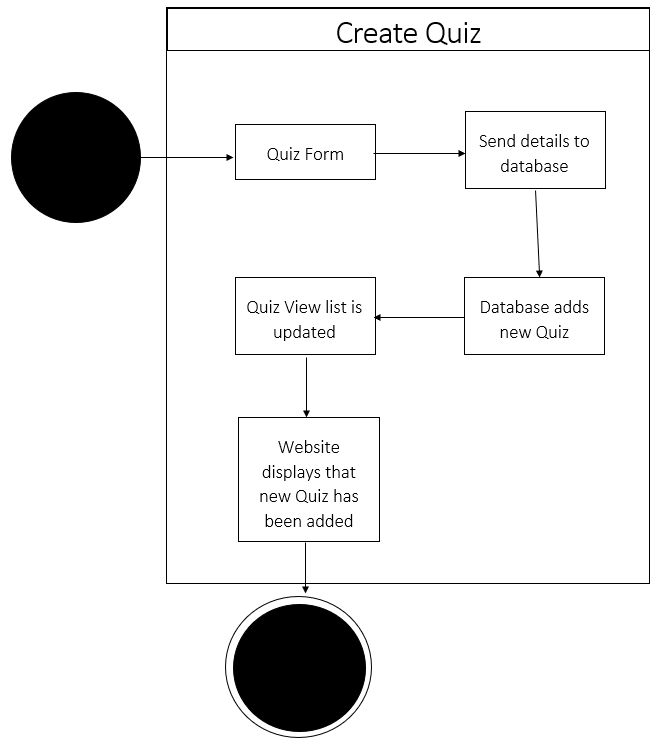{width="3.8020833333333335in"
height="4.761510279965004in"}
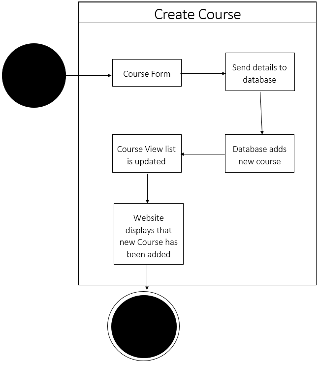{width="3.6145833333333335in"
height="5.074010279965004in"}

-   The Create Quiz state Diagram describes the steps that a Tutor takes
    > to create a Quiz. The tutor navigates to the Quiz Form and
    > completes it. The data is then sent to the WebApps database and
    > then the Quiz View list is updated as a result. The WebApp then
    > displays the new Quiz list based on the update that the Tutor has
    > made.

-   The Create Course state Diagram describes the steps that a tutor
    > takes to create a course. The tutor navigates to the Course Form
    > and completes it. The data is then sent to the WebApps database
    > and then the Course View list is updated as a result. The WebApp
    > then displays the new Course list based on the update that the
    > Tutor has made.

**3.3 Class Diagram**

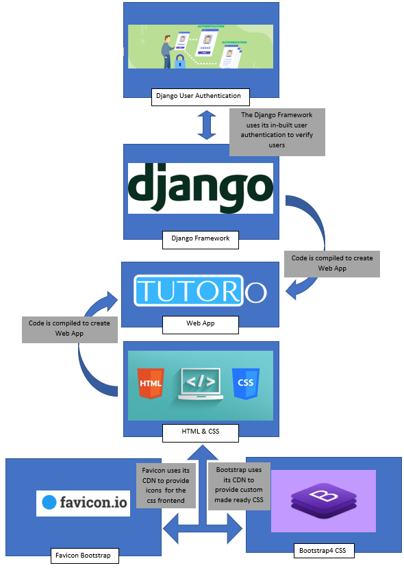{width="5.640625546806649in"
height="7.9740113735783025in"}

**3.5 Data Flow Diagram**

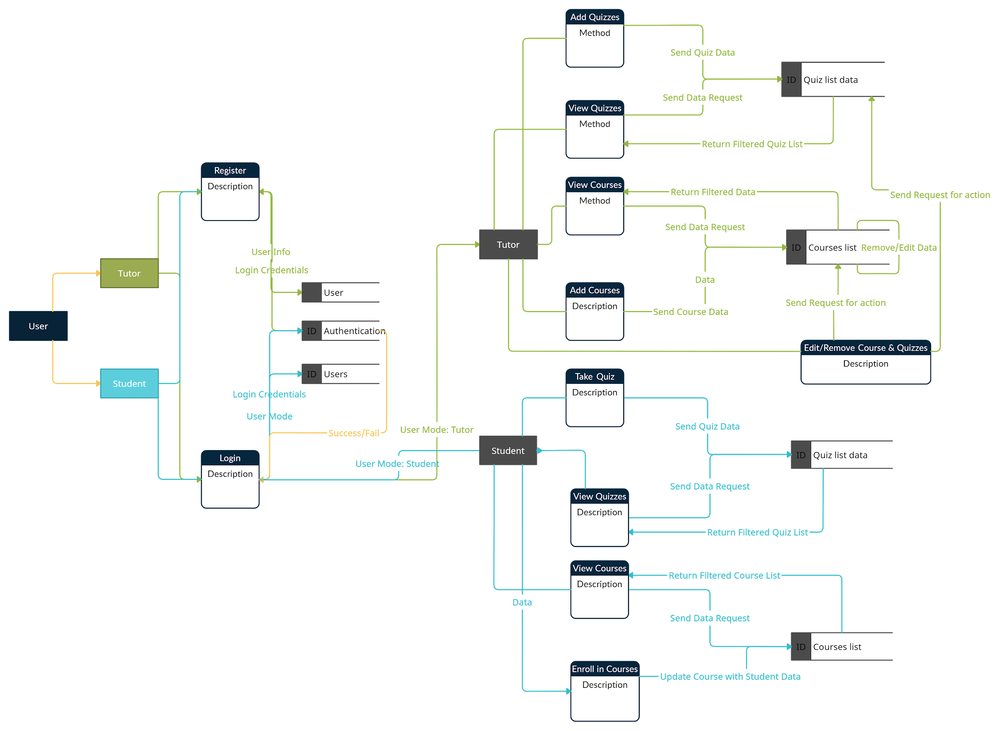{width="8.411458880139982in"
height="6.958333333333333in"}

The Data Flow Diagram shows the way that all the data would flow through
the website going from when a user registers down to when a student
creates quizzes and a user is taking them.

It all starts from when the user decides to register for the WebApp. The
user chooses whether they want to be a student or a tutor and initially
tries to register as one. The users User Inf is then sent to the Uses
Database. Their Login Credentials are also then saved in the User
database ro be used for authentication later. If the User decides to now
sign in their login credentials are taken and if they are authenticated
this is considered a pass and they are logged in as either a student or
tutor depending on what they signed up as. If the Login Credentials
aren\'t recognised then this is considered a fail and the user will be
asked to try again.

The User has now been signed in as either a Tutor or student. This data
is sent on so that the WebApp knows to restrict the users access to only
the pages that are available to their user.

-   If the user is signed in as a tutor they are now able to Add, View,
    > Edit and Remove Courses and Quizzes. When adding either quizzes or
    > courses they simply send new data to be added into the database.
    > This will be queried later by the WebApp when a user wants to view
    > something related to these databases. When a tutor wants to View a
    > course or quiz they send a Data request to the Course or Quiz list
    > databases. The database then filters the required data and returns
    > it to the user.

> When the Tutor attempts to edit or remove data they are sending new
> data that will overwrite currently existing data. This has the
> database work on itself to either change or remove data. This new data
> is then available to be queried later on.

-   If the User has been signed in as a student they are now able to
    > take and view courses and quizzes and enroll in courses. When a
    > student wants to view either a quiz or a course they send a
    > request to the database holding the data for each. The database
    > then filters its dat based on what has been queried and then sends
    > back the filtered data for the student to view.

> When a student is taking a quiz the data that they enter into the quiz
> form is sent to the quiz database. This updates the quiz results and
> the quiz list. When the student decides to view the quiz data later
> the database will return data which will have now changed based on
> what they entered when taking the quiz.
>
> Lastly if a student decides to enroll in a new course they send their
> User data to the database which in turn updates the course with
> student data. This data will be used later on when a tutor wants to
> view what students that they have and it will also be used to return
> data when a student wishes to see what quizzes they have available or
> what courses they are enrolled in.

**3.6 Database Data Organisation**

**[Overall
Database]{.ul}**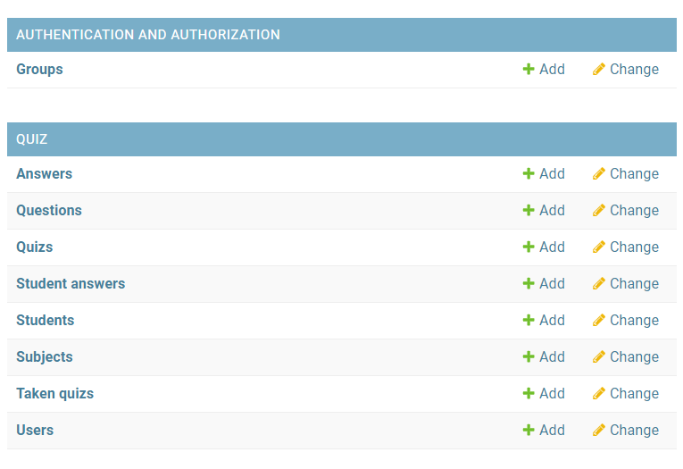{width="6.276042213473316in"
height="2.9682666229221346in"}

**[Answers
Model]{.ul}**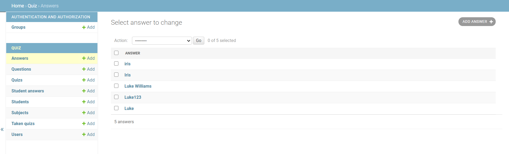{width="7.314291338582677in"
height="2.2153860454943133in"}

**[Quizzes
Model]{.ul}**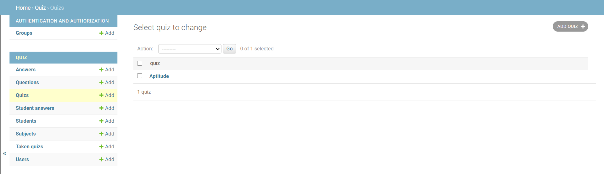{width="7.313190069991251in"
height="2.1212937445319335in"}

**[Questions Model]{.ul}**

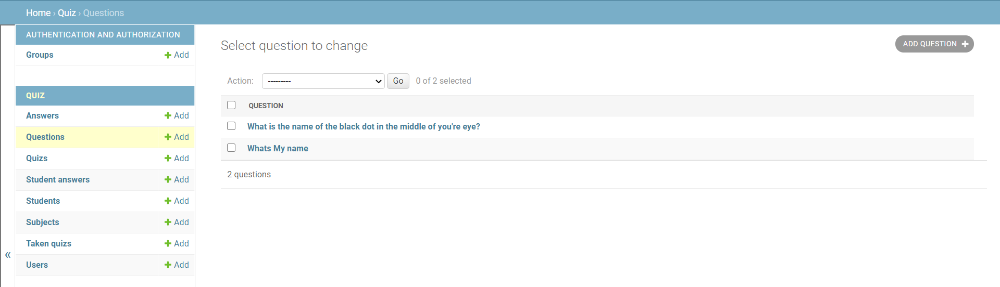{width="7.5927766841644795in"
height="2.1677602799650044in"}

**[Students
Models]{.ul}**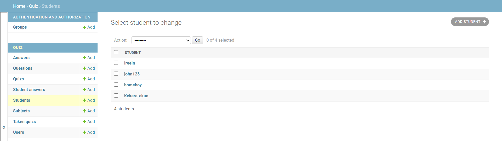{width="7.677232064741907in"
height="1.9799179790026247in"}

**Subjects
Models**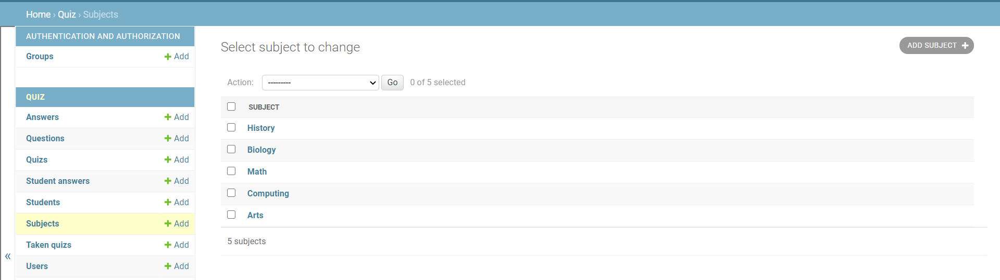{width="7.609375546806649in"
height="2.085765529308836in"}

**[Users
Models]{.ul}**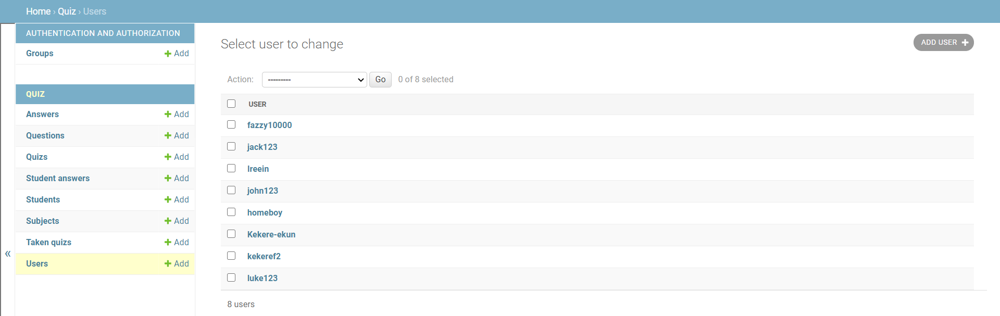{width="7.411458880139983in"
height="2.339834864391951in"}

## **4. Problems and Resolution**

**4.1 Multiple User implementation**

Since we were learning django for the first time we had problems
everyday. But implementing multiple users, being able to distinguish and
set different permissions for each particular user was one of the first
big problems we encountered as these users were going to be used as keys
to many other models.

We had to delve into how the user model functions by looking at the the
django documentation regarding user model:
[[https://docs.djangoproject.com/en/3.1/ref/contrib/auth/]{.ul}](https://docs.djangoproject.com/en/3.1/ref/contrib/auth/)

This made us aware that we are able to customise the user model. This
led us to add the two boolean flags 'is_teacher' and 'is_tutor' to our
own User model which inherits the AbstractUser which was a model
imported from the django.contrib.auth.models

**4.2 Quiz**

Another big problem we encountered was with the question_add and
question_change in tutor.py view. For question_add we wanted to filter
the quiz by the url keyword argument \`pk\` and by the owner, which is
the logged in user to protect this view at the object-level. Meaning
only the owner of the quiz will be able to add questions to it. And for
the question_change we wanted to query both 'quiz' and 'question' to
make sure only the owner of the quiz can change its details and also
only questions that belongs to this specific quiz can be changed via
this url (in cases where the user might have forged/player with the url
params).

We solved this problem with the help of the django documentation on
making queries:
[[https://docs.djangoproject.com/en/3.1/topics/db/queries/]{.ul}](https://docs.djangoproject.com/en/3.1/topics/db/queries/)
and looking at similar problems via stacoverflow.

**4.3 Enrolling in a course**

This problem regards the student user end. The problem we had was when a
student clicked on a particular course, it brought them to the detail
view of the course (CourseDetailView) where we wanted to incorporate an
enroll button which was a form in disguise who added the user to the
course via the POST method when clicked.

We tried to mix a form with the detailview using the 'FormMixin' module
as a parameter to the detail view which allowed us to set up a form as
we normally would. This method didn't work because when the student
clicked the enroll button nothing happened, the user wasn't being saved
to the course.

We went back to the drawing board and made a separate view function
(course_show) that took in a request and the course_id as parameters
which took the current user and courseid. It checked if the user already
existed in the course if not, it saved the user to the course.

## **5.Installation Guide** 

**5.1 Prerequisites**

Django version 3.1.5

Python 3.6

**5.2 Setting up the project**

pip3 install django-crispy-forms

**5.3 Run server from terminal**

Python3 manage.py runserver
