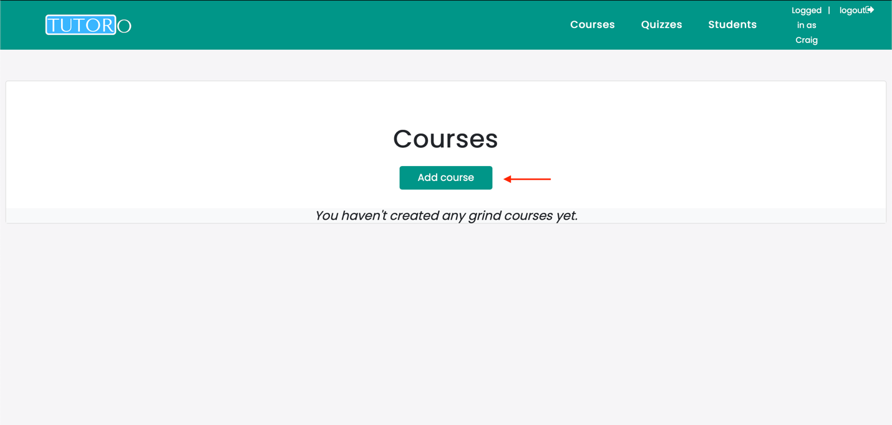

# **TutorO - User Manual**

## **Group Members:**

-   Yann Ndjatang: 18337813

-   Fawwaz Kekere-Ekun: 18408814

## **Table of contents**

  **1. User Manual**

  - Registration

  - Sign In

  -  Sign Out

  -  Contact Us

  **2. TutorManual**

  -  Add Course

  -  Add Quiz

  -  Change Quiz

  -  Delete Quiz

  -  View Results

  -  View All Students

  **3. Student Manual**

  -  View Courses

  -  Enroll in Course

  -  View List of Quizzes

  -  Take Quiz

  -  View Taken Quizzes

## **0. Overview**

**About TutorO**

TutorO is a free to use web app aimed at both Students of 3rd level
education and tutors with the qualifications to teach those students.

The aim of our app was to connect students and tutors on an online
platform which would allow students to get a personalised learning
experience and also allow them to learn from the comfort of their own
homes. This has been seen to be even more important due to the current
ongoing issues in our world at the moment.

## **1. User Manual**

**1.1 Registration**

-   Once you have opened the website you will be brought to the homepage
    that will ask you whether you are a student or a tutor.

-   If you wish to register as a student click the "I'm a student"
    button otherwise, click "I'm a tutor" if you wish to register as a
    tutor.

-   If you have chosen to register as a student you will need to make
    sure to enter all fields: First Name, Username, Email, Interests
    (Only the ones you wish to study.) and Password.

-   The username you enter must be unique.

-   When all the information has been entered correctly, proceed by
    pressing sign up.

**1.2 Sign In**

-   While still on the homepage at the top right corner of the page
    there will be a Sign in button. Click this sign in button and you
    will be brought to the sign in page.

-   Enter your username into the username field and your password into
    the password field and click the login button.

-   You will then be brought to the student dashboard if you are a
    student and the tutor dashboard if you are a tutor.

**Student Dasboard**

**Tutor Dashboard**

-   If you have found yourself on this page by an accident and do not
    have an account you can click either the "Register as a student" or
    "Register as a tutor" button to be redirected to the registration
    pages.

**1.3 Sign Out**

-   When you have signed in as either a student or tutor, if you look to
    the top right of the screen you will see your name and beside it you
    will see a logout button to the right of it.

-   Click this logout button and you will be brought to a logout page in
    which you can log back in as a different user.

## **2. Tutor Manual**

**2.1 Add Course**

-   When a tutor first logs in they will be brought to the courses page
    where they will be able to view and add courses.

-   Press the "Add Course" button to be brought to the page to add a
    course.

-   You will now need to fill in the title, description and subject
    fields. If you wish to go back you can click the "Nevermind" button
    otherwise click the "Save Changes" button.

**2.2 Add Quiz**

-   Go to the quiz page via the navigation bar.

-   You will see a list of all your quizzes made if any. Click the "Add
    Quiz" button to add a new quiz.

-   You can now enter the name of the quiz and the subject it's related
    to. To add questions, click the "Add question" button at the button left corner.

-   Enter a question and click save.

-   After inputting a question and clicking save, you will have multiple
    answer fields where you will have to input at least two answers.

-   To the right of those answer you have to select at least one box as
    the correct answer.

-   At the bottom of the page, If you wish to go back, you can click the
    "Nevermind" button otherwise click the "Save Changes" button

**2.3 Change Quiz**

-   If you wish to change a quiz, go to the quiz page. You can view all
    your available quizzes and from here if you click a quiz you will be
    able to change the fields.

-   After you have finished changing the questions to the quiz you can
    click "Save Changes" or "Nevermind" if you wish to discard your
    changes.

**2.4 Delete Quiz**

-   If you wish to change a quiz, go to the quiz page. You can view all
    your available quizzes and from here if you click a quiz. To the
    right of the nevermind button, there'll be a delete button

**2.5 View Results**

-   Navigate to the quizzes page. Here you will be able to view a list
    of your created quizzes. To the right of each quiz, there will be a
    view results button.

-   By clicking this button you will be able to see the students who
    have taken this quiz.

-   On the top to the right side of the table you will see the average
    score of all your. students.

**2.6 View all your Students**

-   Click on the student tab on the navigation bar.

-   Here you will see a list of the students enrolled in your course(s)
    also with the subject

## **Student Manual**

**3.1 View Courses**

-   When you log in you will be automatically brought to the Courses
    page.

-   If you are on any other page you can go to the nav bar and click
    Courses. This will allow you to view all available courses.

**3.2 Enroll in Course**

-   Go to the Courses page so you can view all the available courses.

-   Click the "Go there" button on a course you wish to enroll in.

-   You will now be brought to the course detail page which explains the
    course in more detail. If you wish to enroll in the course, click
    the "Enroll Now" button otherwise click "go back".

**3.3 View List of Quizzes**

-   To view your quizzes look to the navbar and click "Quizzes".

-   This will bring you to the quiz list page which will display a list
    of all your available quizzes.

**3.4 Take Quiz**

-   To take a quiz, navigate to the quizzes page.

-   Click 'start quiz' on the quiz you want to take.

-   You will now be brought to the quiz where you must answer the
    questions on the quiz.

**3.5 View Taken Quizzes**

-   Navigate to the quizzes page

-   You will now see a table of all the quizzes assigned to you if any

-   On top of the table on the left side you will see two options: New
    and Taken

-   Click on the 'Taken' tab

-   This will show you a table of the quizzes you've completed if any
    along with your score.
